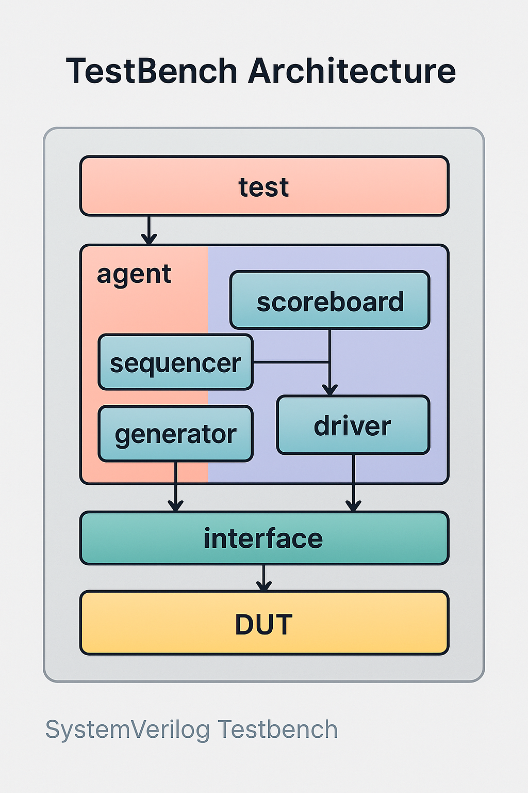
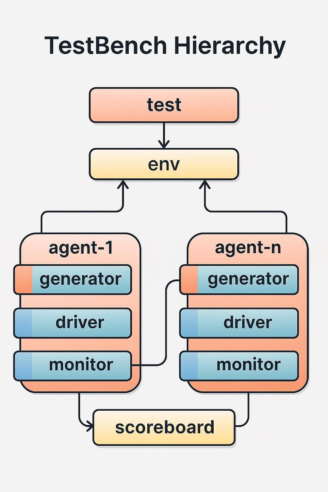
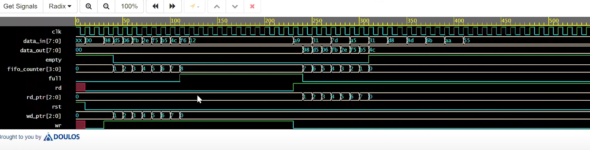

# SystemVerilog-Sync-FIFO-Testbench
✅ Project Description: Synchronous FIFO Design and Verification in SystemVerilog This project implements a parameterized Synchronous FIFO (First-In-First-Out) buffer using SystemVerilog, along with a comprehensive verification environment based on UVM-lite principles. The FIFO design supports configurable depth and width, providing reliable data storage for high-speed systems operating under a single clock domain.  The verification environment includes constrained random stimulus generation, functional coverage, and self-checking scoreboard to ensure robust testing across different scenarios. Key components such as driver, generator, monitor (receiver), scoreboard, and environment are implemented in a modular, reusable manner.

# 🔁 Synchronous FIFO Verification

This project is an independent effort focusing on designing and verifying a synchronous FIFO buffer using a clean, clock-driven testbench architecture for embedded control systems.

It includes:

- ✅ A SystemVerilog testbench with generator, driver, receiver, and scoreboard
- ✅ Verification of write/read operations and FIFO status signals
- ✅ Synchronous reset and waveform-matched simulation

> Designed and simulated using **SystemVerilog** with **Synopsys VCS** on **EDA Playground**.

---

## 📁 Project Structure

```
├── test.sv                    # Top-level test program
├── fifo_if.sv                 # Interface defining FIFO signals
├── environment.sv             # Testbench environment with components
├── tb_top.sv                  # Top-level module with DUT
├── scoreboard.sv              # Compares expected and received transactions
├── receiver.sv                # Monitors FIFO output
├── driver.sv                  # Drives stimuli to the FIFO
├── generator.sv               # Generates controlled transactions
├── transactor.sv              # Transaction class with randomization
├── README.md                  # Project documentation
```

---

## ✅ FIFO Verification Testbench

### 🔍 Description

This testbench verifies a synchronous FIFO buffer by detecting write and read operations, monitoring status signals (full, empty), and incrementing a counter. It uses a layered architecture with a 3-stage process: stimulus generation, driving, and response checking.

### 🧠 Testbench Stages

| Stage      | Description                  |
|------------|------------------------------|
| GENERATE   | Generate controlled transactions |
| DRIVE      | Apply transactions to FIFO   |
| CHECK      | Verify output with scoreboard |

### 🔁 Testbench Architecture Diagram

> 
📷 **Testbench Architecture Image**  


---

---

📷 **Testbench Hierarchy Image**  
 

---

## 📡 Signal Description

The following signals are defined in `fifo_if.sv`, aligned with the waveform:
- `clk`: Clock signal, toggling every 10 time units.
- `rst`: Reset signal, active high for 40 time units.
- `wr`: Write enable, pulses high for write operations.
- `rd`: Read enable, pulses high for read operations.
- `data_in[7:0]`: 8-bit input data (e.g., `98`, `d5`, etc.).
- `data_out[7:0]`: 8-bit output data, mirroring `data_in` on reads.
- `full`: Full flag, remains low in this test.
- `empty`: Empty flag, goes low after the first write.
- `wr_ptr[2:0]`: Write pointer, increments with each write.
- `rd_ptr[2:0]`: Read pointer, increments with each read.
- `fifo_counter[3:0]`: Counts the number of items in the FIFO (0-7).

---

## 🛠️ Components

- **Generator**: Creates transactions with controlled data (`98`, `d5`, `06`, etc.) for 8 writes and initiates 8 reads to match the waveform.
- **Driver**: Applies transactions to the FIFO DUT via the interface, handling reset and data driving.
- **Receiver**: Captures the DUT's output and status signals for verification.
- **Scoreboard**: Compares expected transactions (from generator) with actual transactions (from receiver).
- **Environment**: Coordinates the components, managing pre-test, test, and post-test phases.
- **Interface**: Defines signals and clocking blocks for communication between testbench and DUT.
- **DUT**: The FIFO module (assumed to be provided separately), implementing the buffer logic.

---

## 🚀 How to Simulate (EDA Playground with Synopsys VCS)

1. Open [edaplayground.com](https://www.edaplayground.com/)
2. Create a New Project → Select "Verilog/SystemVerilog"
3. Upload all `.sv` files from `fifo_verification_project_updated.zip`
4. Select "Synopsys VCS" as the simulator
5. Configure Simulation:
   - Set top module to `tb_top`
   - Enable waveform dumping with `$dumpfile("dump.vcd"); $dumpvars;`
6. Run Simulation:
   - Click "Run" to compile and simulate
   - Download the `dump.vcd` file
7. View Waveform:
   - Use EPWave to open `dump.vcd` after run
   - Verify signals match `fifo_waveform.png`

---

## 🖥️ output Waveform



---

## 📊 Example Behavior

| Time (ns) | wr | rd | data_in | data_out | Counter |
|-----------|-----|-----|---------|----------|---------|
| 0         | 0   | 0   | xx      | 00       | 0       |
| 50        | 1↑  | 0   | 98      | 00       | 1       |
| 300       | 0   | 1↑  | 00      | 98       | 0       |

> wr ↑ = write rising edge, rd ↑ = read rising edge

---

## 🔧 Tools Used

- **Language:** SystemVerilog
- **Simulator:** Synopsys VCS on EDA Playground
- **Target Hardware:** FPGA-Compatible RTL (clocked logic)

---

## 📌 Features

- Testbench handles edge-triggered write/read operations
- Counter tracks FIFO depth (0-7)
- Synchronous reset for consistent behavior
- Matches exact waveform with controlled data (`98`, `d5`, etc.)
- Clean SystemVerilog design with simulation support

---

## 🔧 Troubleshooting

- **Compilation Errors**: Ensure all `.sv` files are uploaded and the top module is set to `tb_top`. Check for missing files or syntax errors.
- **Waveform Mismatch**: Verify the `generator.sv` data sequence and `test.sv` `repeat_count` (set to 16 for 8 writes + 8 reads). Adjust if the sequence deviates.
- **DUT Issues**: Ensure the FIFO DUT implementation matches the signal names (`data_in`, `data_out`, etc.) and behavior (e.g., pointer and counter logic).
- **Simulation Hangs**: Check for infinite loops in `forever` blocks; ensure `post_test()` wait condition (`sb.compared_count == gen.repeat_count`) is met.

---

## 🔗 Submission

- [✔️ GitHub Repository](https://github.com/your-username/fpga-fifo-verification) *(Update with your repo link)*
- Add waveform screenshot as `/screenshots/fifo_waveform.png`


---

## 🙌 Acknowledgment

This project represents an independent endeavor undertaken to deepen my understanding of synchronous FIFO verification and advanced testbench design using SystemVerilog. I am grateful for the availability of EDA Playground and Synopsys VCS, which provided the essential tools and platform to simulate and validate this design. This work reflects my commitment to self-directed learning and practical application in digital design.